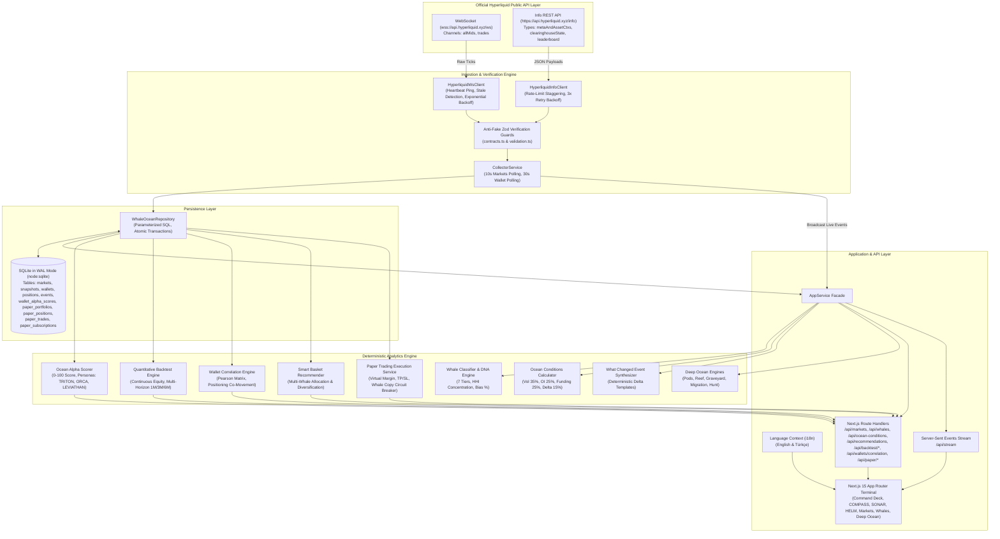
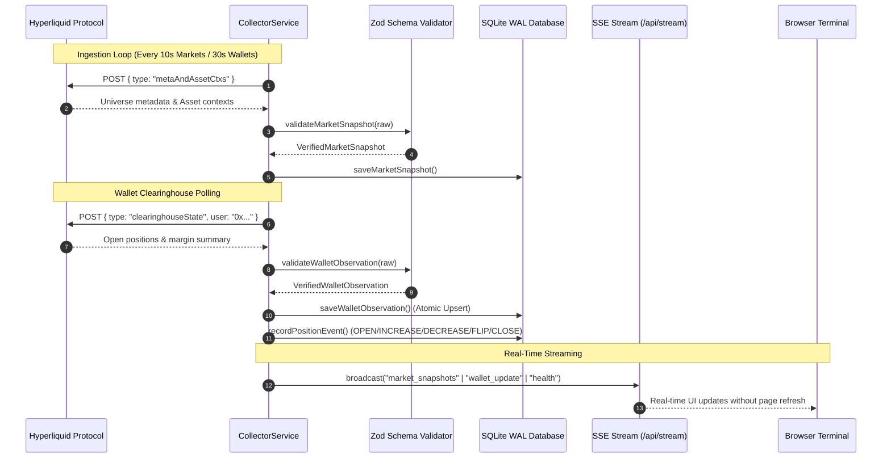

# WHALE OCEAN

> **“Don’t watch the price. Watch the ocean.”**  
> *“See the ocean behind the chart.”*

[](https://nodejs.org/)
[](https://nextjs.org/)
[](https://react.dev/)
[](https://www.typescriptlang.org/)
[](tests/)
[](src/i18n/)
[](LICENSE)

**WHALE OCEAN** is an autonomous, real-time market intelligence and quantitative operations terminal for the [Hyperliquid](https://hyperliquid.xyz/) perpetuals and spot ecosystem. It continuously observes large trader positioning, notional exposure movements, funding carry pressure, open interest velocity, wallet correlations, and market structure shifts directly from official Hyperliquid protocol streams.

---

## Table of Contents

- [Overview](#overview)
- [Key Features & Modules](#key-features--modules)
- [Why Whale Ocean Exists](#why-whale-ocean-exists)
- [Zero-Tolerance Anti-Fake Data Policy](#zero-tolerance-anti-fake-data-policy)
- [Ocean Metaphor & Terminology](#ocean-metaphor--terminology)
- [System Architecture](#system-architecture)
- [Data Flow & Lineage](#data-flow--lineage)
- [Analytical Methodology](#analytical-methodology)
  - [1. Quantitative Whale Tiers](#1-quantitative-whale-tiers)
  - [2. Whale DNA (Behavioral Profiling)](#2-whale-dna-behavioral-profiling)
  - [3. Ocean Conditions Index (0–100)](#3-ocean-conditions-index-0100)
  - [4. Deterministic "What Changed?" Feed](#4-deterministic-what-changed-feed)
  - [5. Ocean Alpha Scoring & Personas (COMPASS)](#5-ocean-alpha-scoring--personas-compass)
  - [6. Quantitative Backtest Engine & Multi-Horizon Analysis (SONAR)](#6-quantitative-backtest-engine--multi-horizon-analysis-sonar)
  - [7. Wallet Correlation Engine & Smart Baskets](#7-wallet-correlation-engine--smart-baskets)
  - [8. Paper Trading Operations Deck (HELM)](#8-paper-trading-operations-deck-helm)
  - [9. Deep Ocean Modules (Pods, Reef, Graveyard, Migration, Hunt, Trails)](#9-deep-ocean-modules)
  - [10. Command Palette, Onboarding Tour & Watchlists](#10-command-palette-onboarding-tour--watchlists)
  - [11. Internationalization (i18n - English & Türkçe)](#11-internationalization-i18n---english--türkçe)
- [Project Structure](#project-structure)
- [Prerequisites & Requirements](#prerequisites--requirements)
- [Installation & Setup](#installation--setup)
- [Configuration](#configuration)
- [Quick Start](#quick-start)
- [API Reference](#api-reference)
- [Development & Verification](#development--verification)
- [Troubleshooting](#troubleshooting)
- [Limitations & Non-Goals](#limitations--non-goals)
- [Contributing](#contributing)
- [Security](#security)
- [License](#license)

---

## Overview

Most cryptocurrency trading interfaces focus exclusively on candlestick charts and isolated price movements. **WHALE OCEAN** inverts this paradigm by treating the orderbook, open interest, and large account clearinghouse states as an interconnected aquatic ecosystem:

1. **Environmental State Monitoring:** Real-time calculation of protocol-wide stress, funding pressure, and volatility.
2. **Whale Entity Tracking:** Transparent observation of accounts holding $\ge \$50\text{k}$ in notional exposure across 7 quantitative tiers.
3. **Behavioral DNA:** Quantification of trader concentration (Herfindahl-Hirschman Index), directional bias (% long), and flip frequency without synthetic guessing.
4. **Factual Audit Trail:** Chronological reconstruction of verified position opening, scaling, flipping, and liquidation events.
5. **Whale Alpha Radar (`COMPASS`):** Multi-factor 0–100 alpha scoring, persona profiling (`TRITON`, `ORCA`, `LEVIATHAN`), and anti-martingale drawdown filters.
6. **Quantitative Backtest Lab (`SONAR`):** Friction-accurate candle replay ($0.035\%$ taker fee, slippage, 8h funding carry), multi-wave candles, strategy presets, multi-horizon performance (1M, 3M, 6M), and Pearson wallet correlation matrices.
7. **Paper Operations Deck (`HELM`):** Isolated margin virtual trading sandbox ($\$100\text{k}$ starting balance) with live mark-to-market valuations, 1-click smart basket subscriptions, and a $15\%$ copy-trading circuit breaker.
8. **Ecosystem Modules:** Pods (wallet clustering), Reef (liquidity depth), Graveyard (liquidation watch), Migration (cross-asset capital rotation), and Hunt (counter-positioning squeeze heatmaps).
9. **Global Terminal Ergonomics:** Bilingual interface (English & Turkish), Command Palette (`Ctrl+K` / `Cmd+K`), interactive Onboarding Tour, and persistent Watchlist management.

---

## Key Features & Modules

| Module | Route | Primary Capability |
| :--- | :--- | :--- |
| **Command Deck** | `/` | Real-time Ocean Condition Index, Ocean Density, Water Pressure, Whale Exposure delta, and deterministic live event feed. |
| **Whale Compass** | `/compass` | Multi-factor Ocean Alpha Scorer (0–100), behavioral personas (`TRITON`, `ORCA`, `LEVIATHAN`), risk tiers, and copy modal. |
| **Sonar Backtest** | `/sonar` | Quantitative backtest lab with mark-to-market continuous equity curves, multi-horizon matrix (1M, 3M, 6M), Pearson correlation heatmap, and smart baskets. |
| **Helm Deck** | `/helm` | Virtual paper trading operations deck, manual order tickets, isolated margin leverage, TP/SL, active copy whale manager with 15% circuit breaker. |
| **Markets Matrix** | `/markets` | Full Hyperliquid universe grid with live mark prices, 24h volume, open interest, and funding rate carry. |
| **Whales Universe** | `/whales` | 7-tier categorized whale list, behavioral DNA cards, and deep wallet profile inspection modals. |
| **Whale Trails** | `/trails` | Real-time chronological audit trail of verified position adjustments (`OPEN`, `INCREASE`, `DECREASE`, `FLIP`, `CLOSE`). |
| **Pods Cluster** | `/pods` | Statistical wallet clustering detecting synchronized positioning and co-movement pods. |
| **Reef Depth** | `/reef` | Open interest concentration barriers, absorption depth, and liquidation walls across strike zones. |
| **Graveyard Watch** | `/graveyard` | High-risk liquidation watch, underwater whale casualties, and severe drawdown casualties. |
| **Migration Flow** | `/migration` | Cross-asset capital rotation tracker measuring net inflow and outflow between assets (e.g. BTC, ETH, SOL). |
| **Whale Hunt** | `/hunt` | Counter-positioning heatmap showing liquidation proximity and squeeze risk targets. |

---

## Why Whale Ocean Exists

Traditional analytics tools for decentralized perpetual exchanges suffer from three major shortcomings:
- **Mock Fallbacks:** Displaying simulated data or synthetic mock charts when exchange APIs experience latency or disconnection.
- **Speculative Hype:** Using LLMs or heuristic marketing scripts to generate unfounded claims (e.g., *"Insiders are preparing for a pump"*).
- **Black-Box Metrics:** Providing proprietary "smart money" scores without revealing the mathematical formulas or raw underlying metrics.

Whale Ocean was engineered to establish an uncompromising standard of transparency:
- Every data point is mathematically derived from Hyperliquid's official public API layer.
- When live data is disconnected or insufficient, the terminal explicitly reports `DATA UNAVAILABLE` rather than fabricating values.
- All natural language events are generated via deterministic templates strictly grounded in verified database deltas.

---

## Zero-Tolerance Anti-Fake Data Policy

Whale Ocean enforces a hard architectural boundary against simulated or fabricated data:

| Policy Area | Strict Enforcement Rule | Fallback Behavior |
| :--- | :--- | :--- |
| **Market Data** | ZERO mock candles, simulated ticks, or third-party aggregator feeds (Binance, CoinGecko). | Explicit `DATA UNAVAILABLE` or `WAITING FOR VERIFIED LIVE DATA`. |
| **Wallets** | ZERO synthetic addresses or demo accounts. Only valid `0x` hex addresses observed on Hyperliquid. | Unobserved wallets return HTTP 404. |
| **Positions** | ZERO fake leverage, unrealized PnL, or synthetic margin states. | Missing positions report zero active exposure. |
| **History** | ZERO backfilled synthetic history. If the terminal has run for 2 hours, exactly 2 hours of data is shown. | `Observed history begins: [timestamp]` banner. |
| **Whale DNA** | Requires $\ge 3$ verified historical position events before generating statistical DNA. | `Insufficient observed history (< 3 position events recorded)`. |
| **Event Feed** | ZERO speculative terms allowed (`pump`, `dump`, `moon`, `smart money`, `alpha`, `insider`). | Deterministic statements of verified dollar and percentage deltas. |

---

## Ocean Metaphor & Terminology

| Concept | Market Reality | Quantitative Definition & Description |
| :--- | :--- | :--- |
| **Ocean** | Hyperliquid Protocol | The unified perpetual and spot market ecosystem. |
| **Whales** | Large Traders | Observed wallets with aggregate notional exposure $E_{\text{total}} \ge \$50\text{k}$. |
| **Pods** | Correlated Wallets | Statistically clustered wallets exhibiting correlated positioning and directional consensus. |
| **Currents** | Directional Flow | Net whale exposure delta, funding carry pressure, and OI velocity. |
| **Ocean Density** | Open Interest | Total outstanding open contract notional across all active markets. |
| **Water Pressure** | Funding Conditions | Protocol-wide mean 8-hour funding rate carry stress. |
| **Reefs** | Liquidity Depth | Concentration zones and market absorption barriers across open interest tiers. |
| **Graveyard** | Liquidation Watch | Deep underwater whale casualties, severe drawdowns, and high mortality risk. |
| **Migration** | Capital Rotation | Observed net whale capital inflow and outflow rotation between assets. |
| **Whale Hunt** | Counter-Positioning | Liquidation threshold proximity heatmaps and critical squeeze targets. |
| **Storm** | Market Volatility | High price volatility, rapid OI expansion/contraction, and funding stress. |
| **Whale DNA** | Behavioral Profile | Empirical statistics: Directional Bias, Market Concentration (HHI), and Flip Frequency. |
| **Whale Trails** | Position Audit Trail | Chronological log of observed position changes (`OPEN`, `INCREASE`, `DECREASE`, `FLIP`, `CLOSE`). |
| **Ocean Conditions** | Climate Index | Transparent 0–100 composite index (`CALM`, `ACTIVE`, `RESTLESS`, `STORM`). |
| **Compass** | Alpha Radar | Quantitative whale scoring (0–100) & persona classification (`TRITON`, `ORCA`, `LEVIATHAN`). |
| **Sonar** | Backtest Lab | Scientific replication engine replaying real Hyperliquid candles with fee & funding carry friction, multi-horizon matrix, and wallet correlation. |
| **Helm** | Operations Deck | Non-custodial virtual paper trading sandbox with mark-to-market PnL, smart basket subscriptions, and copy-trading circuit breakers. |

---

## System Architecture

Whale Ocean is structured as a modular full-stack application with clean separation between data ingestion, persistence, analytical processing, and client presentation.



---

## Data Flow & Lineage



---

## Analytical Methodology

### 1. Quantitative Whale Tiers

Wallets are classified strictly by total observed notional exposure ($E_{\text{total}} = \sum |\text{size}_i| \times \text{entryPrice}_i$):

| Tier | Minimum Notional | Maximum Notional | Role Description |
| :--- | :--- | :--- | :--- |
| **FISH** | $\$0$ | $\$50,000$ | Baseline retail account. |
| **DOLPHIN** | $\$50,000$ | $\$250,000$ | Active mid-size participant. |
| **SHARK** | $\$250,000$ | $\$1,000,000$ | Substantial directional trader. |
| **HUMPBACK** | $\$1,000,000$ | $\$5,000,000$ | Institutional-scale account. |
| **ORCA** | $\$5,000,000$ | $\$20,000,000$ | High-impact market maker or fund. |
| **BLUE WHALE** | $\$20,000,000$ | $\$50,000,000$ | Protocol mega-trader. |
| **SPERM WHALE** | $\$50,000,000$ | $\infty$ | Top-tier sovereign or protocol whale entity. |

*Note:* Tiers serve as visual organization brackets. The exact observed dollar exposure is always presented alongside the classification.

### 2. Whale DNA (Behavioral Profiling)

When a wallet accumulates $\ge 3$ verified position events, the analytics engine derives four behavioral metrics:
- **Directional Bias (% Long):**  
  $$\text{Bias}_{\text{Long}} = \left( \frac{\sum \text{Notional}_{\text{Long}}}{\sum \text{Notional}_{\text{Total}}} \right) \times 100$$
- **Market Concentration (Herfindahl-Hirschman Index - HHI):**  
  $$\text{HHI} = \sum_{i=1}^n s_i^2 \quad \text{where } s_i \text{ is the asset exposure percentage } (0 \le \text{HHI} \le 10,000)$$
  *An HHI of 10,000 signifies 100% exposure in a single asset.*
- **Position Flip Frequency:** Count of directional reversals ($\text{LONG} \leftrightarrow \text{SHORT}$) over a rolling 30-day window.
- **Average Position Notional:** Mean absolute dollar notional of recorded position modification events.

### 3. Ocean Conditions Index (0–100)

The market climate is quantified using a multi-factor composite index:

$$\text{Index} = 0.35 \cdot V_{\text{vol}} + 0.25 \cdot D_{\text{OI}} + 0.25 \cdot P_{\text{funding}} + 0.15 \cdot \Delta W_{\text{whale}}$$

1. **Realized Volatility ($V_{\text{vol}}$):** Mean absolute percentage price delta across assets over rolling 1h ($0\% \rightarrow 0, 4\%+ \rightarrow 100$).
2. **Ocean Density ($D_{\text{OI}}$):** Percentage expansion or contraction of total Open Interest ($0\% \rightarrow 0, 20\%+ \rightarrow 100$).
3. **Water Pressure ($P_{\text{funding}}$):** Protocol-wide mean absolute 8-hour funding rate ($0.0000 \rightarrow 0, 0.0006+ \rightarrow 100$).
4. **Whale Delta ($\Delta W_{\text{whale}}$):** Net notional exposure shift across tracked accounts ($0 \rightarrow 0, \$50\text{M}+ \rightarrow 100$).

| Condition | Index Range | Environmental Description |
| :--- | :--- | :--- |
| **`CALM`** | 0 – 25 | Low realized volatility, stable open interest, baseline funding rates. |
| **`ACTIVE`** | 26 – 55 | Normal market flow, healthy turnover, moderate positioning adjustments. |
| **`RESTLESS`** | 56 – 75 | Elevated volatility, rapid OI expansion/contraction, expanding funding carry stress. |
| **`STORM`** | 76 – 100 | Extreme market turbulence, aggressive whale repositioning, severe funding stress. |

### 4. Deterministic "What Changed?" Feed

Natural language summaries are synthesized deterministically without external generative models:
- Position events where $|\Delta \text{Notional}| \ge \$250,000$ produce wallet exposure updates.
- Market open interest shifts where $|\Delta \text{OI}| \ge 5.0\%$ and $|\Delta \text{OI}| \ge \$1,000,000$ produce density change updates.
- Template-driven generation guarantees that zero speculative hallucinations enter the feed.

### 5. Ocean Alpha Scoring & Personas (COMPASS)

The **COMPASS** engine rates observed large wallets on a transparent 0–100 scale, eliminating black-box "smart money" mysticism:

$$\text{Alpha Score} = 0.30 \cdot S_{\text{winRate}} + 0.25 \cdot S_{\text{profitFactor}} + 0.20 \cdot S_{\text{drawdown}} + 0.15 \cdot S_{\text{volume}} + 0.10 \cdot S_{\text{diversity}}$$

- **Win Rate Component ($S_{\text{winRate}}$):** Evaluates trade profitability ratio ($0\% \rightarrow 0, 70\%+ \rightarrow 100$).
- **Profit Factor Component ($S_{\text{profitFactor}}$):** Gross gains divided by gross losses ($0.5 \rightarrow 0, 3.0+ \rightarrow 100$).
- **Drawdown Penalty ($S_{\text{drawdown}}$):** Anti-martingale filter heavily penalizing peak-to-trough losses ($0\% \rightarrow 100, 50\%+ \rightarrow 0$).
- **Consistency & Volume ($S_{\text{volume}}$):** Minimum event threshold preventing sample-size bias ($\ge 10$ events required for high scores).
- **Multi-Asset Diversification ($S_{\text{diversity}}$):** Reward for consistent performance across multiple assets vs single-asset luck.

#### Ocean Personas:
- **`TRITON` (Apex Consistent):** High Win Rate ($>60\%$), Profit Factor $>2.0$, and Max Drawdown $<15\%$. Disciplined capital preservation.
- **`ORCA` (Heavy Momentum):** High notional sizes, trend-riding bias, and rapid profit compounding during market expansions.
- **`LEVIATHAN` (Contrarian Swing):** Counter-trend position building, high capacity absorption, and wide stop tolerances.

#### Risk Tiers:
- **`LOW RISK`:** Alpha Score $\ge 75$, Max Drawdown $\le 15\%$.
- **`MEDIUM RISK`:** Alpha Score $50 - 74$, Max Drawdown $\le 30\%$.
- **`HIGH RISK`:** Alpha Score $< 50$ or Drawdown $> 30\%$.

---

### 6. Quantitative Backtest Engine & Multi-Horizon Analysis (SONAR)

The **SONAR** laboratory executes quantitative simulations against verified Hyperliquid candle sequences or recorded wallet event streams without lookahead bias:

- **Data Fidelity:** 100% real OHLCV candle replay ($15\text{m}, 1\text{h}, 4\text{h}, 1\text{d}$) fetched from Hyperliquid's official protocol layer.
- **Continuous Mark-to-Market Equity:** Calculates realistic portfolio fluctuations at every intra-candle step rather than only at trade closures.
- **Multi-Wave Candle Synthesis:** Reconstructs granular intra-candle volatility paths (Open $\rightarrow$ High/Low $\rightarrow$ Close) for accurate stop-loss/take-profit triggering.
- **Realistic Friction Modeling:**
  - **Taker Fee:** $0.035\%$ deducted on entry and exit.
  - **Slippage:** Configurable base slippage ($0.05\%$ default) scaled dynamically by position size.
  - **Funding Rate Carry:** 8-hour funding payments deducted based on historical directional imbalance.
  - **Execution Latency:** Simulated 500ms fill delay to prevent zero-latency backtest distortions.
- **Multi-Horizon Matrix (1M, 3M, 6M):**
  - Evaluates rolling performance across differentiated temporal horizons: **1 Month (30d)**, **3 Months (90d)**, and **6 Months (180d)**.
  - Computes annualized **Sharpe Ratio**, **Sortino Ratio**, **Max Drawdown ($MDD$)**, and **Return %** per horizon to separate short-term momentum from long-term durability.
  - Highlights alpha degradation or consistency shifts across market regimes.
- **Strategy Presets:**
  - *Whale Replication:* Exact replication of observed whale entries, scaling, and exits.
  - *Trend Following:* EMA crossover ($20/50$) with ATR volatility stops.
  - *Mean Reversion:* RSI ($14$) oversold/overbought pullbacks to VWAP.
  - *Momentum Breakout:* 20-period Donchian channel breakout with trailing stops.

---

### 7. Wallet Correlation Engine & Smart Baskets

#### Pearson Wallet Correlation Engine
To prevent portfolio concentration in identical trades, Whale Ocean computes pairwise Pearson correlation coefficients ($r$) across observed whale wallets:

$$r_{xy} = \frac{\sum (x_i - \bar{x})(y_i - \bar{y})}{\sqrt{\sum (x_i - \bar{x})^2 \sum (y_i - \bar{y})^2}}$$

- Analyzes concurrent position sizes, directional alignment, and net PnL trajectories.
- Dynamic scope limits allow selecting top 5, 10, 15, or 20 whales, filtering by tracked watchlist status, or inputting custom `0x` addresses.
- **Interactive Heatmap:** Visualizes positive correlation ($r > 0.6$, co-movement risk) and negative/uncorrelated behavior ($r < 0.2$, true diversification).

#### Smart Baskets
- **Algorithmic Multi-Whale Baskets:** Automatically curates baskets combining high-alpha whales with low mutual correlation ($r < 0.35$).
- Diversifies risk across different trading personas (`TRITON` + `ORCA` + `LEVIATHAN`).
- **1-Click Helm Subscription:** Enables users to subscribe their virtual paper portfolio to an entire diversified basket with proportional capital allocation.

---

### 8. Paper Trading Operations Deck (HELM)

The **HELM** operations deck provides a non-custodial virtual trading execution terminal:

- **Isolated Portfolio Capital:** Default initial capital of $\$100,000$ virtual balance maintained in local SQLite storage.
- **Margin & Leverage Engine:**
  $$\text{Margin Required} = \frac{\text{Size} \times \text{Entry Price}}{\text{Leverage}}$$
  Liquidation and Stop Loss orders are deterministically checked and triggered against live mark prices.
- **Automated Whale Copy Engine:**
  - Subscribe to high-scoring `TRITON` or `ORCA` whales with custom allocation limits ($\$$ cap).
  - Automated replication of position adjustments in paper trading mode.
  - **15% Drawdown Circuit Breaker:** Automatically pauses replication and preserves capital if an individual copied whale suffers a $15\%$ peak-to-trough decline.
- **Copied Whales Bar:** Real-time visibility and 1-click management of active whale subscriptions.
- **Zero-Fake Guarantee:** Virtual capital is simulated, but order fills, slippage, mark-to-market valuations, and wallet triggers are 100% bound to verified Hyperliquid feeds.

---

### 9. Deep Ocean Modules

Whale Ocean features specialized analytical sub-views addressing distinct market dimensions:

1. **Pods (`/pods`):** Identifies coordinated wallet clusters that exhibit high co-movement and synchronized positioning across assets, exposing collective whale behavior.
2. **Reef (`/reef`):** Visualizes orderbook liquidity depth and open interest concentration across price tiers, highlighting potential support and resistance barriers.
3. **Graveyard (`/graveyard`):** Liquidation risk monitor displaying underwater whale positions, margin health deterioration, and accounts approaching critical liquidation prices.
4. **Migration (`/migration`):** Measures capital rotation between assets over 1h, 4h, and 24h intervals, identifying where whale liquidity is flowing from and to.
5. **Hunt (`/hunt`):** Counter-positioning dashboard mapping price proximity to clustered whale liquidation levels for squeeze anticipation.
6. **Trails (`/trails`):** A chronological, streaming log of all verified wallet events (`OPEN`, `INCREASE`, `DECREASE`, `FLIP`, `CLOSE`) across the entire observed universe.

---

### 10. Command Palette, Onboarding Tour & Watchlists

- **Command Palette (`Ctrl+K` / `Cmd+K`):** Global command bar allowing instant fuzzy search across all navigation routes, market symbols, watched wallets, and system actions.
- **Interactive Onboarding Tour:** Guided multi-step walkthrough introducing new users to the Ocean Condition Index, Compass Alpha Radar, Sonar Backtesting, and Helm Paper Operations.
- **In-App Methodology Modal:** Instant, accessible mathematical documentation and formula references accessible from anywhere in the terminal.
- **Persistent Watchlist:** Fast toggle to track specific whale addresses or market assets with local persistence and dedicated status filtering.

---

### 11. Internationalization (i18n - English & Türkçe)

Whale Ocean includes complete, first-class bilingual support:
- **Supported Locales:** **English (`en`)** and **Türkçe (`tr`)**.
- **Comprehensive Coverage:** 100% of UI labels, metrics, explanations, tooltips, persona descriptions, and navigation elements are localized.
- **Zero Layout Shift:** Ergonomically designed translations preserving responsive grid and tabular layouts.
- **Persistence:** User language preference is automatically saved in `localStorage` and respected across sessions.

---

## Project Structure

```text
WhaleOcean/
├── docs/                               # Core documentation & architectural specifications
│   ├── DATA-SOURCES.md                 # Data lineage, API endpoints & anti-fake boundary
│   ├── HYPERLIQUID-INTEGRATION.md      # WebSocket lifecycle, polling intervals & rate limits
│   ├── METHODOLOGY.md                  # Formulas, whale tiers, Ocean Conditions index
│   └── superpowers/                    # Design specs and implementation milestones
│       ├── specs/
│       │   ├── 2026-09-19-whale-ocean-design.md
│       │   ├── 2026-09-20-paper-trading-backtest-recommendations-design.md
│       │   ├── 2026-09-20-multi-horizon-backtest-wallet-correlation-design.md
│       │   └── 2026-09-20-turkish-i18n-design.md
│       └── plans/
│           ├── 2026-09-19-whale-ocean-milestone1.md
│           ├── 2026-09-20-paper-trading-backtest-recommendations.md
│           ├── 2026-09-20-multi-horizon-backtest-wallet-correlation.md
│           └── 2026-09-20-turkish-i18n.md
├── src/
│   ├── analytics/                      # Pure mathematical & transformation engines
│   │   ├── backtest/                   # Quantitative backtest & multi-horizon engine
│   │   ├── correlation/                # Pearson wallet correlation engine
│   │   ├── paper-trading/              # Paper trading execution service & copy loop
│   │   ├── recommendations/            # Ocean Alpha Scorer & Smart Basket recommender
│   │   ├── graveyard-engine.ts         # Liquidation risk & underwater position tracking
│   │   ├── hunt-engine.ts              # Counter-positioning & squeeze proximity
│   │   ├── migration-engine.ts         # Cross-asset capital rotation flow
│   │   ├── ocean-conditions.ts         # Multi-factor environmental condition index
│   │   ├── pods-cluster.ts             # Wallet co-movement clustering
│   │   ├── reef-engine.ts              # Liquidity depth & concentration barriers
│   │   ├── whale-classifier.ts         # 7-tier classification & Whale DNA (HHI, bias)
│   │   └── what-changed.ts             # Deterministic event synthesis & formatting
│   ├── app/                            # Next.js 15 App Router pages and API routes
│   │   ├── api/                        # HTTP Route Handlers
│   │   │   ├── backtest/               # /api/backtest and /api/backtest/multi-horizon
│   │   │   ├── candles/                # /api/candles (OHLCV candle series)
│   │   │   ├── graveyard/              # /api/graveyard
│   │   │   ├── hunt/                   # /api/hunt
│   │   │   ├── markets/                # /api/markets
│   │   │   ├── migration/              # /api/migration
│   │   │   ├── ocean-conditions/       # /api/ocean-conditions
│   │   │   ├── paper/                  # /api/paper/portfolio, /order, /copy, /basket-subscribe
│   │   │   ├── pods/                   # /api/pods
│   │   │   ├── recommendations/        # /api/recommendations (Alpha scores & baskets)
│   │   │   ├── reef/                   # /api/reef
│   │   │   ├── stream/                 # /api/stream (Server-Sent Events)
│   │   │   ├── trails/                 # /api/trails
│   │   │   ├── wallets/correlation/    # /api/wallets/correlation
│   │   │   ├── whales/                 # /api/whales & /api/whales/[address]
│   │   │   └── what-changed/           # /api/what-changed
│   │   ├── compass/page.tsx            # /compass Whale Alpha Radar & Recommendations
│   │   ├── graveyard/page.tsx          # /graveyard Liquidation Watch
│   │   ├── helm/page.tsx               # /helm Paper Trading Operations Deck
│   │   ├── hunt/page.tsx               # /hunt Counter-Positioning Squeeze Radar
│   │   ├── markets/page.tsx            # /markets Matrix view
│   │   ├── migration/page.tsx          # /migration Capital Flow Tracker
│   │   ├── pods/page.tsx               # /pods Correlated Wallet Clusters
│   │   ├── reef/page.tsx               # /reef Liquidity Depth Matrix
│   │   ├── sonar/page.tsx              # /sonar Quantitative Backtest Lab
│   │   ├── trails/page.tsx             # /trails Position Audit Stream
│   │   ├── whales/page.tsx             # /whales Universe view
│   │   ├── globals.css                 # Oceanic styling, scrollbars & color tokens
│   │   ├── layout.tsx                  # Root layout with dark theme & shell wrapper
│   │   └── page.tsx                    # Ocean Command Deck (Root view)
│   ├── collector/                      # Hyperliquid ingestion clients & background service
│   │   ├── collector-service.ts        # Ingestion coordinator & event broadcast hub
│   │   ├── hyperliquid-info.ts         # Info REST API client (meta, leaderboard, clearinghouse)
│   │   └── hyperliquid-ws.ts           # WebSocket client with heartbeat, reconnect & stale check
│   ├── components/                     # Modular React 19 UI components
│   │   ├── common/                     # CommandPalette, OnboardingTour, MethodologyModal, Badges
│   │   ├── compass/                    # CompassRadar, WhaleCard, CopyModal
│   │   ├── graveyard/                  # GraveyardTable
│   │   ├── helm/                       # PortfolioSummary, ManualOrderTicket, LivePositionsTable, HelmDeck
│   │   ├── hunt/                       # HuntZones
│   │   ├── layout/                     # Shell, Navbar, ConnectionBadge, MobileMenu
│   │   ├── markets/                    # MarketTable
│   │   ├── migration/                  # MigrationFlow
│   │   ├── ocean/                      # OceanConditionMeter, WhaleExposureCard, MarketChart, WhatChangedFeed
│   │   ├── pods/                       # PodGrid
│   │   ├── reef/                       # ReefMatrix
│   │   ├── sonar/                      # SonarWorkspace, MultiHorizonMatrix, CorrelationHeatmap, EquityCurveChart
│   │   ├── trails/                     # TrailsStream
│   │   └── whales/                     # WhaleTable, WhaleProfileModal, WhaleDnaCard, WhaleTrailsTimeline
│   ├── db/                             # Persistence layer (node:sqlite)
│   │   ├── client.ts                   # SQLite client with WAL mode & schema bootstrap
│   │   ├── repository.ts               # Repository pattern with atomic transactions
│   │   └── schema.sql                  # DDL schema (12 tables including paper & alpha tables)
│   ├── i18n/                           # Internationalization infrastructure
│   │   ├── locales/                    # en.ts & tr.ts dictionary definitions
│   │   ├── LanguageContext.tsx         # React Context for language state & persistence
│   │   ├── index.ts                    # Hook exports & translation helpers
│   │   └── types.ts                    # Strongly typed translation schemas
│   ├── services/                       # Application & UI state services
│   │   ├── app-service.ts              # Application service facade & singleton
│   │   └── useWatchlist.ts             # Persistent watchlist management hook
│   └── types/
│       ├── contracts.ts                # Runtime Zod schemas & TypeScript type definitions
│       └── validation.ts               # Anti-fake assertion guards
├── tests/                              # Automated Vitest test suite (100 tests across 26 suites)
│   ├── alpha-scorer.test.ts            # Scoring formulas, anti-martingale penalties & personas
│   ├── analytics.test.ts               # Whale tiering, DNA calculation, ocean conditions
│   ├── api-multi-horizon-correlation.test.ts # Multi-horizon & correlation API endpoint tests
│   ├── api-paper-backtest.test.ts      # Paper trading & backtest HTTP endpoint contracts
│   ├── api.test.ts                     # Core API data retrieval & error handling
│   ├── backtest-engine.test.ts         # Friction modeling, metrics (Sharpe/Sortino) & equity curve
│   ├── collector.test.ts               # Hyperliquid response parsing & health tracking
│   ├── compass-page.test.tsx           # /compass UI rendering and copy modal
│   ├── contracts.test.ts               # Strict Zod boundary tests & mock rejection
│   ├── correlation-heatmap.test.tsx    # Correlation heatmap rendering & selection
│   ├── db-paper-backtest.test.ts       # Database persistence for alpha, portfolios & trades
│   ├── db.test.ts                      # SQLite WAL transactions, upserts & history queries
│   ├── e2e-data-integrity.test.ts      # End-to-end anti-fake audit & banned word checks
│   ├── engines.test.ts                 # Pods, Reef, Graveyard, Migration, Hunt engines
│   ├── helm-page.test.tsx              # /helm order submission & position rendering
│   ├── i18n.test.ts                    # Translation completeness & dictionary integrity
│   ├── multi-horizon-engine.test.ts    # 1M, 3M, 6M multi-horizon calculations
│   ├── multi-horizon-matrix.test.tsx   # Multi-horizon matrix UI table & sorting
│   ├── navbar-navigation.test.tsx      # Navigation links, language switcher & menu tests
│   ├── ocean-view.test.tsx             # SSR tests for ocean condition components
│   ├── paper-service.test.ts           # Virtual margin execution & circuit breaker
│   ├── smart-basket.test.ts            # Smart basket curation & allocation logic
│   ├── sonar-page.test.tsx             # /sonar backtest execution flow & chart
│   ├── ui-components.test.tsx          # Connection badge & status indicator tests
│   ├── wallet-correlation-engine.test.ts # Pearson correlation calculations
│   └── whales-view.test.tsx            # Whale table, timeline & DNA modal rendering
├── package.json                        # Scripts, dependencies & project metadata
├── tailwind.config.ts                  # Oceanic palette configuration
├── tsconfig.json                       # TypeScript compiler options (ES2022, bundler)
└── vitest.config.ts                    # Vitest configuration with path aliases
```

---

## Prerequisites & Requirements

- **Runtime:** Node.js `v22.5.0` or higher, or `v24.x`.  
  *Whale Ocean uses the built-in `node:sqlite` module (`DatabaseSync`), requiring Node.js 22.5.0+.*
- **Operating System:** Linux, macOS, or Windows (PowerShell / Command Prompt).
- **Network Access:** Outbound HTTPS and WebSocket access to:
  - `https://api.hyperliquid.xyz` (Port 443)
  - `wss://api.hyperliquid.xyz` (Port 443)
- **API Keys:** **None.** Whale Ocean monitors public on-chain and orderbook states.

---

## Installation & Setup

1. **Clone the repository:**
   ```bash
   git clone https://github.com/senoldak/WhaleOcean.git
   cd WhaleOcean
   ```

2. **Install dependencies:**
   ```bash
   npm install
   ```

3. **Verify the installation with the test suite:**
   ```bash
   npm test
   ```
   *Expected output: 26 test files passed, 100 tests passed.*

---

## Configuration

Whale Ocean is designed for zero-setup local execution with sensible defaults. Optional parameters can be supplied via environment variables:

| Variable | Type | Default | Description |
| :--- | :--- | :--- | :--- |
| `SQLITE_DB_PATH` | String | `./whale_ocean.db` | Absolute or relative path to the local SQLite database file. |
| `PORT` | Number | `3000` | HTTP port for the Next.js web application. |
| `NODE_ENV` | String | `development` | Runtime environment (`development`, `production`, `test`). |

To configure custom settings, create a `.env.local` file in the repository root:
```bash
# Example .env.local
PORT=3000
SQLITE_DB_PATH=./data/whale_ocean.db
```

---

## Quick Start

Launch the development server:
```bash
npm run dev
```

Open [http://localhost:3000](http://localhost:3000) in your browser.

### Expected Startup Sequence
1. The terminal initializes the local SQLite database in WAL mode (`whale_ocean.db`).
2. The background collector connects to Hyperliquid WebSocket (`wss://api.hyperliquid.xyz/ws`) and subscribes to `allMids`.
3. The collector fetches the initial market snapshots via `metaAndAssetCtxs` and seeds top accounts from the official leaderboard.
4. The UI connection badge in the top right transitions:  
   `CONNECTING...` $\rightarrow$ `LIVE` (displaying active latency in milliseconds, e.g., `35ms`).
5. Real-time market metrics, whale exposures, and the environmental index populate the Command Deck.

---

## API Reference

Whale Ocean provides a built-in REST and Server-Sent Events (SSE) interface.

### Endpoints Overview

| Method | Endpoint | Description | Query Parameters |
| :--- | :--- | :--- | :--- |
| `GET` | `/api/markets` | Returns latest verified market snapshots and connection health. | None |
| `GET` | `/api/whales` | Returns observed whale accounts, total exposure, and open positions. | `tier`: Optional filter (`FISH`, `DOLPHIN`, `SHARK`, `HUMPBACK`, `ORCA`, `BLUE_WHALE`, `SPERM_WHALE`) |
| `GET` | `/api/whales/:address` | Returns detailed profile, active positions, Whale DNA, and event history for a specific `0x` address. | Route param `:address` |
| `GET` | `/api/ocean-conditions` | Returns current environmental index, classification (`CALM`–`STORM`), and sub-metric breakdown. | None |
| `GET` | `/api/what-changed` | Returns the latest deterministic, non-speculative market and position shift events. | None |
| `GET` | `/api/recommendations` | Returns ranked whale recommendations scored by Ocean Alpha Score (0–100), persona, risk tier, and smart baskets. | `minScore`, `persona`, `riskTier` |
| `POST` | `/api/backtest` | Executes a historical backtest against real Hyperliquid candle series or recorded whale events. | JSON payload: `config` |
| `GET` | `/api/backtest/multi-horizon` | Returns multi-horizon backtest performance leaderboard (1M, 3M, 6M) across whales. | `asset`, `limit` |
| `GET` | `/api/wallets/correlation` | Returns Pearson correlation matrix between whale wallets based on positioning and PnL. | `scope`, `trackedOnly`, `addresses` |
| `GET` | `/api/paper/portfolio` | Returns virtual paper trading balance, equity, margin usage, and open positions. | None |
| `POST` | `/api/paper/order` | Submits, updates, or cancels virtual paper orders with isolated margin and TP/SL. | JSON payload: `order` |
| `POST` | `/api/paper/copy` | Subscribes or unsubscribes to paper copy-trading for a specific whale address. | JSON payload: `copyConfig` |
| `POST` | `/api/paper/basket-subscribe` | Subscribes paper portfolio to an entire diversified smart basket. | JSON payload: `basketConfig` |
| `GET` | `/api/candles` | Returns verified historical OHLCV candle series from Hyperliquid. | `asset`, `interval`, `startTime`, `endTime` |
| `GET` | `/api/pods` | Returns clustered wallet pods exhibiting co-movement and synchronized positioning. | None |
| `GET` | `/api/reef` | Returns liquidity depth concentration and open interest absorption tiers. | None |
| `GET` | `/api/graveyard` | Returns high-risk underwater whale positions and liquidation distress metrics. | None |
| `GET` | `/api/migration` | Returns cross-asset net capital rotation metrics across time windows. | None |
| `GET` | `/api/hunt` | Returns liquidation threshold proximity heatmaps and short/long squeeze targets. | None |
| `GET` | `/api/trails` | Returns chronological log of observed position modifications across all wallets. | `limit`, `offset` |
| `GET` | `/api/stream` | Real-time Server-Sent Events (SSE) stream for live price ticks, wallet updates, and health states. | None |

---

## Development & Verification

### Available Scripts

| Command | Action |
| :--- | :--- |
| `npm run dev` | Starts Next.js development server with hot reload on port 3000. |
| `npm run build` | Compiles production application bundle. |
| `npm run start` | Runs the compiled production build. |
| `npm run lint` | Executes Next.js ESLint checks. |
| `npm test` | Executes the Vitest automated test suite once. |

### Running the Test Suite
The repository includes comprehensive unit, integration, and data integrity tests:
```bash
npm test
```
*Current test suite: **100 tests passed across 26 suites**.*

To run tests in watch mode during development:
```bash
npx vitest
```

---

## Troubleshooting

### Problem: `ExperimentalWarning: SQLite is an experimental feature`
- **Cause:** Node.js outputs an informational warning when loading the built-in `node:sqlite` module.
- **Impact:** None. SQLite in Node 22+ functions reliably in WAL mode.
- **Solution:** The warning is normal and does not impact runtime execution. To suppress warnings, start Node with `node --no-warnings ...`.

### Problem: Connection Badge Displays `DATA UNAVAILABLE` or `STALE`
- **Cause:** Outbound network connection to `wss://api.hyperliquid.xyz/ws` is blocked or experiencing packet loss, or no message has been received within 10 seconds.
- **Solution:**
  1. Verify outbound internet connectivity.
  2. Confirm that corporate firewalls or VPNs permit WebSocket traffic to `*.hyperliquid.xyz` over port 443.
  3. The client will automatically reconnect using exponential backoff ($1\text{s} \dots 30\text{s}$).

### Problem: `Insufficient observed history` in Whale DNA Modal
- **Cause:** The observed wallet has fewer than 3 recorded position change events in the local database.
- **Solution:** Whale Ocean never fabricates synthetic trading behavior. Allow the terminal to run as the wallet executes position adjustments to accumulate verified history.

---

## Limitations & Non-Goals

1. **Not a Trading Bot:** Whale Ocean does not execute live on-chain orders, route live transactions, manage private keys, or interact with trade execution contracts on mainnet.
2. **Not Financial Advice or Price Prediction:** The platform measures empirical facts. It never issues buy/sell recommendations or price targets.
3. **Observation Universe Scope:** Whale Ocean tracks large accounts discovered via the Hyperliquid leaderboard and high-notional transactions ($>\$100\text{k}$). It does not claim 100% census coverage of every small wallet on the protocol.
4. **Historical Boundary:** The local terminal only displays history that has been observed and recorded during its active runtime.

---

## Contributing

Contributions are welcomed from the open-source community. Please follow these principles:
1. **Strict Code & Data Integrity:** Any PR that introduces mock data, simulated fallback values, or speculative hype language will be rejected.
2. **Test Coverage:** All new features or bug fixes must include corresponding tests under `tests/` and pass `npm test`.
3. **Coding Standards:** Use TypeScript strict mode and follow existing architecture conventions.

To submit changes:
```bash
git checkout -b feature/your-feature-name
# Make changes and ensure all tests pass
npm test
git commit -m "feat: describe your change"
git push origin feature/your-feature-name
# Open a Pull Request on GitHub
```

---

## Security

Whale Ocean is an observational read-only terminal:
- **No Credentials Required:** The software does not accept, require, or store private keys, seed phrases, or exchange API secrets.
- **Injection Prevention:** All database operations utilize parameterized queries through `node:sqlite`.
- **Input Sanitization:** All incoming protocol data is validated against strict Zod schemas before persistence.

To report a security concern, please open a private GitHub security advisory or contact the maintainers directly.

---

## License

This project is licensed under the **MIT License**. See the [LICENSE](LICENSE) file for details.
